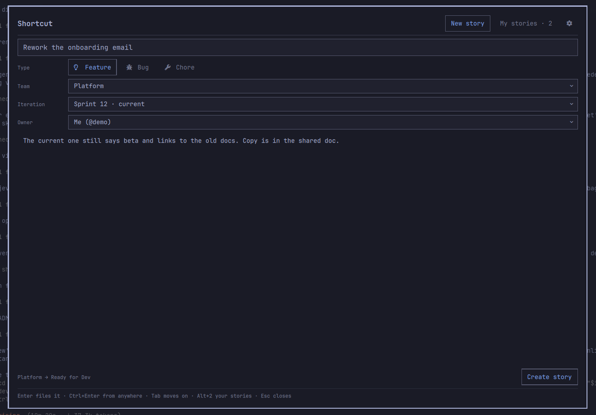

# Shortcut Stories

Write a [Shortcut](https://shortcut.com) story from a panel that drops over
whatever you are doing, and put the ones assigned to you where they belong
without opening a browser. Drawn like the rest of Omarchy: the menu's
background, border and font, with Hyprland's corner rounding.



- **Plugin ID:** `io.github.kimm-stensborg.shortcut-stories`
- **Kind:** service + bar widget + overlay
- **License:** MIT
- **Requires:** Omarchy 4 (Quattro) with `omarchy-shell`, and a Shortcut account

## Dependencies

| Package | Used for |
|---------|----------|
| `curl` | Talking to the Shortcut API |
| `jq` | Reading and building the JSON that goes over it |
| `libsecret` (`secret-tool`) | Keeping your API token in the keyring |
| `gh` (optional) | Filling a new story from a GitHub pull request URL, and the PRs Solve's branches get |
| `wl-clipboard` | Pasting an image into a new story (ships with Omarchy, as do `grim` and `slurp` for screenshots) |

`secret-tool` is optional. Without it the token goes in a `0600` file under
`~/.config/omarchy-shortcut-stories/` instead.

The tests additionally want `python3` (the mock API server), `node` (the
`Model.js` cases) and `qt6-declarative` (`qmllint`).

## Install

```bash
omarchy plugin add https://github.com/kimm-stensborg/omarchy-shortcut-stories
~/.config/omarchy/plugins/io.github.kimm-stensborg.shortcut-stories/install.sh
```

`omarchy plugin add` clones the repository into
`~/.config/omarchy/plugins/`. A plugin runs unsandboxed inside the shell
process, so read what you are installing first -- this one included.

`install.sh` enables the plugin and binds a key to the panel, proposing
**SUPER + ALT + T** and offering the next free combination if Hyprland already
has that one. It backs up `bindings.lua` before touching it. `--no-bind` skips
the key, `--key "SUPER + ALT + C"` names one.

It also binds **SUPER + ALT + B** to a new bug from a screenshot, but only if
nothing has that combination: this one is never taken over. `--shot-key`
names another, `--no-shot-key` leaves it out.

To put the count in the bar as well:

```bash
omarchy bar put io.github.kimm-stensborg.shortcut-stories --section right
```

The number beside the icon is the same one as **My stories**, so it follows
the list filter. The icon carries a small badge when a story has been
assigned to you since you last opened it. Opening the story clears that one.
The stories already assigned the first time the plugin looks are not new, so
the badge starts clear. Hovering the icon does not list them.

A story assigned to you also says so in a notification, with its name, once.
Clicking it opens that story in the panel. It stays on screen, stacked
with any others, until you dismiss it, and Do Not Disturb holds it back like
any other app's. More than three at once arrive as
one notification, which opens the list. Stories already waiting when the
shell starts are not announced, so a restart never repeats them, and one that
leaves your list and comes back is announced again. Nothing more is written
to disk for this: which stories you have been told about is kept in memory.
New stories are noticed when the list refreshes, so within **Refresh while
closed** of being assigned.

A dot under the icon means an agent Solve started wants you back: red while
one is waiting for an answer, the accent colour when one has finished. A
click then opens that story rather than the list. An agent counts as seen
once its story is open in the panel or its pane has focus in Herdr. It
counts again if it goes back to work and stops again. Agents that were
already waiting when the shell started do not light it.

### Your token

The panel is locked until it has one. The first time you open it there is no
form -- just what the plugin needs and a button, and `Enter` presses it. That
opens a terminal running:

```bash
~/.config/omarchy/plugins/io.github.kimm-stensborg.shortcut-stories/bin/shortcut login
```

Create a token under **Settings → API Tokens** in Shortcut. It is read without
echoing it and checked against the API before it is stored, so a typo fails in
the terminal rather than later in the bar. The panel watches for the token
while you type it and unlocks itself once it works, for the next two minutes.

A token that Shortcut later rejects -- revoked, or from another workspace --
locks the panel again and says so, rather than showing a form whose pickers
are empty and whose Create button cannot work.

Settings stay reachable while locked, so a developer can turn on
**Demo workspace** (see [Developing](#developing)) without a token.

The token goes to your keyring where there is one. It is never passed on a
command line, so it does not show up in `ps`, and the shell process never sees
it: only `bin/shortcut` reads it.

## Remove

```bash
~/.config/omarchy/plugins/io.github.kimm-stensborg.shortcut-stories/bin/shortcut logout
omarchy plugin remove io.github.kimm-stensborg.shortcut-stories
```

Then delete the `-- Shortcut Stories overlay` block from
`~/.config/hypr/bindings.lua`.

## Working beside another window

The panel sits over the middle of the screen but does not take it over:
the rest stays clickable, and a click outside the panel does not close it.
Click into the browser to copy a pull request's URL, and the browser has the
keyboard; the panel's border fades to say so. `SUPER + ALT + T` -- or a click
in one of its fields -- brings the keyboard back, and `Ctrl + V` pastes. Only
`Esc`, or `SUPER + ALT + T` while the panel has the keyboard, closes it.

## Keys

| Key | Does |
|-----|------|
| **SUPER + ALT + T** | Show the panel, ready to write. When it is up but another window has the keyboard, brings the keyboard back; when it has the keyboard, hides it. |
| **SUPER + ALT + B** | Pick a region of the screen; a new bug opens with it. |
| `Alt + S` | On the form: the panel steps aside while you pick a region, and comes back with it. |
| `Ctrl + V` | On the form, with an image on the clipboard: adds it. Text still pastes as text. |
| `Enter` (locked) | Opens the terminal to set up your token. |
| `Enter` | From the title, files the story. The fast path: summon, type, Enter. |
| `Ctrl + Enter` | Files the story from anywhere, including the description. |
| `Tab` / `Shift + Tab` | The next field, and the one before. |
| `Alt + F` / `Alt + B` / `Alt + C` | Feature, bug, chore, from any field. |
| `Alt + 1` / `Alt + 2` | A new story, or the ones assigned to you. |
| `Ctrl + Tab` | Swaps between those two. |
| `Ctrl + ,` | Settings. |
| `Ctrl + R` | Re-read your workspace and your stories. |
| `Alt + I` | In the list, only the sprint today falls inside. Again shows everything. |
| `Esc` | Closes a dropdown first. On a new story with something in it, warns, then cancels it and goes back to where you started it. Elsewhere it goes back a step, then closes the panel. |
| `?` or `F1` | Every key, on a card over the panel. `?` where you are not typing, `F1` anywhere. |

In **My stories**: `↑` `↓` walk the list, `Enter` (or a click) opens the story,
and `Ctrl + O` opens it in your browser. **All** and the current sprint sit
above the list. `Alt + I`, or a click, switches between them. The sprint is
whichever one today falls inside. Where more than one does, the list shows
all of them, and the button says so. A story with no sprint is not in that
list. The choice is remembered.

In an **open story**: `←` `→` pick a state and `Enter` moves it there,
`Ctrl + O` opens it in Shortcut, `Ctrl + G` opens its pull request on
GitHub, `Alt + A` solves it, `Alt + P` opens a pull request for it, and
`Esc` goes back to the list.

## Writing a story

Only a name is required; everything else is optional and Shortcut fills in
what you leave out. The line under the form says where the story is about to
land -- `Platform → Ready for Dev` -- so you can see what picking a team did
before you file it.

Paste a GitHub pull request URL into the title and the form fills itself from
the PR: the title, the description, and the PR kept as an external link on the
story. `Enter` on the URL does the same and files it once the lookup lands.
Reading the PR uses `gh`, so you need the GitHub CLI signed in for private
repos.

A story's board is decided by its workflow state and not by its team, so
naming a team without a state would file it under the right team on the
workspace's default board, in a column that team never looks at. Picking a
team therefore resolves its workflow's default state and sends that too. With
no team picked, nothing is sent and Shortcut applies its own default.

A story can have several owners. **Owners** adds one person at a time, and
everyone already on the story sits under it as a chip. Click a chip, or
`Delete` on it, to take that person off. No chips is unassigned. It starts
with whoever **Owner** in the settings names.

Editing a story keeps every owner it already has, including ones the form
did not touch, so renaming a story shared between two people leaves both on it.

Saving an edit sends only the fields you changed. A field you left alone is
not written back, so a colleague who rewrote the description while you fixed
the title keeps their description. Before it writes, the story is read again.
If someone changed one of *your* fields in Shortcut since you pressed Edit,
nothing is saved and the panel says which field. Open the story again to see
their version.

Filing a story clears the title, the description and the type, and leaves the
team, iteration and owners where they were -- five stories in a row usually
belong to the same sprint. Turn that off with **Keep team and iteration after
filing**.

To give up on a new story, press **Cancel** beside Create, or `Esc` twice:
the first warns -- and lets go of the field you were typing in -- the second
throws the draft away. Either way you land where you started it: the list,
the story you had open, or the settings, if you came from there with
`Alt + 1`; the panel closes if it opened straight onto the form. A blank
form has nothing to lose, so one `Esc` does it. Closing the panel any other
way keeps the draft for next time.

### From a screenshot

**SUPER + ALT + B** freezes the screen and lets you pick a region, with the
same picker as Print. The panel then opens on a new bug with the picture on
it, focus in the title. Esc in the picker gives up without opening anything.
On the form, `Alt + S` does the same without losing what you had written,
and `Ctrl + V` adds an image already on the clipboard -- Print puts one
there, and so does copying an image in a browser. A draft you had started
keeps its type; a blank one becomes a bug.

Each image shows as a thumbnail under the owners, with a cross to take it
off. When the story is filed they are uploaded to Shortcut first, attached
to the story, and shown in its description under whatever text you wrote.
If an upload fails, nothing is filed and the draft keeps its images.
Screenshots taken this way wait in the cache and are deleted once the story
is filed; ones left by a draft you threw away are cleared after a week.
Images can only go on a new story for now, not onto one you are editing.

## Reading a story

A row in the list is a glance -- reference, name, and how long since it
last changed. The stories are grouped by how far along they are, and the
state most of a group shares is named once, in its heading: a row only says
its state when it is a different one, so the story sitting in Code Review
among ten that are Ready for Development is the one that stands out. A story
an agent is working on has a small robot beside it, in the accent colour when
the agent wants you back. `Enter` or a click
opens the story itself: who it is for, which sprint, the estimate, the
deadline and its labels, and under all of that the description, the tasks
and the comments. The description and the comments are rendered rather than
left as markdown source. That is the part you need in front of you to
actually do the work, and it is why the list does not try to show it.

Under the title sits a row of chips: the reference, its pull request, the
agent working on it, and every other link on the story -- a Figma file, a
doc, a GitHub issue -- labelled by where it goes. A click opens the story in
Shortcut, the PR on GitHub, or the link; a right-click copies it instead,
`sc-1234` for a commit message or the address to paste somewhere.

The description runs the full width of the card rather than sharing it with
the facts, because it is prose and a narrow column of prose is harder to read.
It wraps mid-word where it has to, so a pasted URL stays inside the card.
The line breaks it was written with stay line breaks: markdown would otherwise
fold them into one paragraph. A blank line stays a paragraph, and a list or a
heading stays its own block. A comment is wrapped the same way.
Comments do the same, oldest first, with who wrote each one and when. A reply
is indented. A comment Shortcut has deleted is left out, and so is one with
no text left. A comment marked as a blocker says so on its byline.

Tasks sit between the description and the comments, each one marked done or
still open. A story with neither says so, rather than leaving a gap you would
otherwise go to Shortcut to check.

The list carries only what a row needs. Opening a story fetches the rest,
because pulling every description, task and comment for every story would be
a lot of bytes nobody reads. Comments come back on that same story; there is
no second request.

## Moving a story

The states run along the bottom of an open story in one row, in the order of
its workflow. A workspace with a dozen of them, named things like "Review -
Definition of Done", scrolls sideways instead of stacking into a block under
the story. The state the arrows are on stays in view. `←` `→` pick one and
`Enter` moves it; a click does the same. The state the story is in keeps a dot
beside it.

Only that story's own workflow is ever offered: Shortcut will accept a state
from a different workflow without complaint and quietly move the story to a
board nobody on that team reads.

The story moves the moment you pick, and moves back if Shortcut refuses.
For a few seconds afterwards the footer says where it went, and `Ctrl + Z`
moves it back -- an Enter pressed one state too far costs nothing.

The footer carries only the two or three keys that matter where you are.
The rest are on the card `?` opens: every key, grouped by where it works.

## Solving a story

`Alt+A`, or **Solve** beside Open, opens a screen with the prompt, the agent,
the workspace and whether it runs in a worktree. Enter starts it. Herdr keeps
the terminal. The panel closes once the agent has the story, so the keyboard
is Herdr's.

The agent is a new tab, or a new git worktree on a branch named `sc-<id>`.
Nothing is typed into a pane that is already running. If an agent for that
story is already up, Solve focuses it and does not send the story again. A
worktree that already has the branch is opened rather than created. The
checkout is left in place afterwards; Herdr is where you remove it.

**Workspace**, **Worktree** and **Agent** live in the settings, and again on
that screen. `←` `→` pick a workspace, `W` toggles a worktree, and the prompt can be
rewritten before `Enter` starts. Inside the prompt, `Enter` is a new line
and `Ctrl+Enter` starts. `Esc` goes back to the story. A saved workspace is already selected. A story
that names exactly one workspace has that one selected instead, when none is
saved.

The agent is told the title, the link, the description, the tasks and the
comments, and to leave the Shortcut story where it is and not to push. In the
checkout it creates the branch itself. In a worktree the branch is already
checked out, and the prompt says so.

Once an agent has the story, a chip under its title says where it has got
to: `Agent working · sc-1234 · 3 commits · uncommitted changes`. Waiting
for you and finished are in the accent colour, because both mean it is your
turn. It is Herdr's status and what git says about `sc-<id>` in the agent's
directory, checked every ten seconds while a story is open or any Solve
agent is running, and with the ordinary refresh otherwise. Nothing leaves
the machine to find it out. The chip is only there while Herdr has an agent
for that story. The bar shows a dot when one of them wants you (see the bar,
above).

The story's pull request is a chip beside it, with how it is doing:
`acme/app#42  open · checks passing · waiting for review`. Red when a check
failed or changes were asked for, the accent when it is merged or approved
with everything green. It is the PR linked on the story, or else the one
GitHub has for `sc-<id>`, looked up from the agent's directory -- so a PR the
agent's branch got shows up without anyone linking it. It is read with `gh`
when the story opens, as soon as the branch appears, and every two minutes
while the story is on screen.

`Alt+P`, or **PR** beside Solve, opens that pull request once the agent has
committed something and there is none yet. The button, and Alt+P in the
footer, only show up then. The agent is told not to push, so
this is where it happens, and not before you have seen it: a screen shows
`sc-1234 → main · 3 commits`, the directory, the title (the story's name) and
a description linking back to the story, all editable, and whether it is a
draft (`D`). Uncommitted changes in that directory are called out, since a
push leaves them behind. `Enter` pushes `sc-<id>` to origin and runs
`gh pr create`; `Esc` goes back without doing either. A push GitHub refuses
stops there with git's reason, and nothing is ever forced.

The PR is then linked on the story, changing only its links. The move strip
lands on the next in-progress state after the one the story is in -- Code
Review after In Development, say -- and `Enter` moves it there. Nothing moves
until you press it. Where Alt+P has nothing to do, the story says why.

Herdr is optional. Without it, Solve says so and the rest of the panel is
unchanged.

## Settings

`Ctrl + ,`, or the gear. The page is grouped: a new story, the list, Solve,
and the bar. Changes apply as you make them; there is no Save. A dot marks
an option that is no longer the default.

**Team**, **Iteration** and **Owner** are filled from your workspace, so you
pick a real team and a real sprint rather than typing a name and hoping. Set
them and every new story starts there.

Each is resolved against the workspace every time rather than trusted: a team
that has been archived, a sprint that has finished or moved to another team,
or a colleague who has left all read as unset instead of being sent to
Shortcut. **Owner** stores "me" rather than your user id, so it still means
you after a re-invite, and **Iteration** stores "current" rather than a sprint
id when you pick "whichever one is current", so it follows the sprint over
rather than going stale when this one ends.

| Option | Default | Does |
|--------|---------|------|
| Team | none | The team a new story starts on |
| Iteration | none | A sprint by name, or whichever one today falls inside |
| Owner | Me | Who a new story starts assigned to; more can be added on the form |
| Type | Feature | What a new story starts as |
| Keep team and iteration after filing | on | Leaves them set for the next story |
| Next to the glyph | Open stories | The same number as My stories, or how many of those are in progress |
| Opens on | New story | Which pane the keybinding lands on |
| Show finished stories | off | Keeps done stories in the list |
| Show | Everything assigned to me | The list, or only the sprint today falls inside |
| Workspace | Ask each time | The Herdr workspace Solve starts in |
| In a worktree | off | Solve checks the story out beside the repo, on `sc-<id>` |
| Agent | Grok | Which coding agent Solve starts |
| Refresh while closed | 5 min | How often the count is brought up to date |
| Notify when assigned | on | A notification for each new story, as well as the badge |
| Demo workspace | off | A made-up workspace; never calls Shortcut. Only shown while developing |

## What it stores

| Path | What |
|------|------|
| keyring, service `shortcut` | Your API token, or `~/.config/omarchy-shortcut-stories/token` at `0600` without a keyring |
| `~/.cache/omarchy-shortcut-stories/refs.json` | Teams, workflows, people and iterations, so the pickers are filled before you open the panel |
| `~/.cache/omarchy-shortcut-stories/status.json` | The count and how many stories you have not opened, for the bar widget to read |
| `~/.cache/omarchy-shortcut-stories/seen.json` | The stories you have opened, so the badge only counts new ones |
| `~/.cache/omarchy-shortcut-stories/shots/` | Screenshots and pasted images waiting for their story to be filed |
| `~/.config/omarchy/shell.json` | The settings above, on the widget's entry. Team is stored as its id, so renaming a team in Shortcut does not unset it; a team name typed by hand still works. |

The reference cache is re-read every six hours, and whenever the panel opens
on data more than fifteen minutes old. When Shortcut cannot be reached the
cached copy is shown, marked as older, rather than an empty panel.

## Why the bar widget reads a file

The shell hands `shell` to the bar itself, to services and to panel loaders,
but never to a bar widget, and `pluginServiceFor` refuses a caller with no id.
So a widget cannot reach its own plugin's service at all. Rather than give
every monitor's copy of the widget its own poller, the service writes what the
bar needs to `status.json` and the widgets watch that one file.

## A note on Shortcut's search

A story you have just filed does not appear in Shortcut's search for a few
seconds. The list is told about it rather than asked, so it shows up at once
and is reconciled ten seconds later.

## Command line

`bin/shortcut` is the whole backend and works on its own:

```bash
bin/shortcut refs | jq '[.groups[].name]'   # your teams
bin/shortcut mine | jq '.stories[].name'    # what is assigned to you
echo '{"name":"From the terminal"}' | bin/shortcut create
echo '{"name":"Broken","files":["/tmp/shot.png"]}' | bin/shortcut create
bin/shortcut shot --open                    # pick a region, open a new bug with it
bin/shortcut pr https://github.com/owner/repo/pull/42
bin/shortcut show 1234 | jq -r .story.description
bin/shortcut move 1234 5002
bin/solve workspaces | jq '.workspaces[].label'
bin/solve status | jq '.agents[] | {name, status, branch}'
echo '{"url":"https://github.com/acme/app/pull/42"}' | bin/solve pr | jq .pr
```

`bin/solve start` reads one JSON object on stdin (`workspaceId`, `cwd`,
`worktree`, `kind`, `agent`, `branch`, `prompt`) and prints one JSON object
back. It talks to Herdr only. It never sees the Shortcut token.

Everything but `login` and `logout` prints one JSON object, `{"ok": false,
"code": ..., "error": ...}` when something went wrong. `create` and `update`
read their story from stdin rather than taking flags, so a description with
quotes, newlines and `$` in it survives.

## Files

| Path | What |
|------|------|
| `manifest.json` | Plugin id, entry points, and the bar widget's settings schema |
| `bin/shortcut` | The only thing that holds the token or speaks HTTP |
| `bin/solve` | The only thing that talks to Herdr; reads the agents' branches with git and their PRs with `gh` |
| `Model.js` | Every pure decision: picker lists, the create body, the story list |
| `Store.qml` | The service: one poller, one reference cache, every CLI call |
| `Overlay.qml` | The card, the mode switch and the key handling |
| `ComposePane.qml` | The new-story form |
| `StoriesPane.qml` | The stories assigned to you |
| `StoryDetail.qml` | One story opened up: description, tasks, comments, and where it can move |
| `SolveReview.qml` | The prompt, agent, workspace and worktree before Solve starts |
| `PrReview.qml` | The branch, title and description before a pull request is pushed and opened |
| `KeysCard.qml` | Every key, grouped by where it works, over the panel on `?` |
| `SettingsPane.qml`, `SettingsColumn.qml` | The settings page |
| `BarWidget.qml` | The glyph, the count, and the badge for stories you have not opened |
| `install.sh` | Enables the plugin and binds a key |
| `test.sh` | Mock-API tests, `Model.js` under node, and `qmllint` |

## Developing

```bash
git -C ~/.config/omarchy/plugins/io.github.kimm-stensborg.shortcut-stories pull ~/Projects/omarchy-shortcut-stories main
omarchy restart shell
```

Do not edit the installed copy: the plugin manager marks it dirty and refuses
to fast-forward, and the work is somewhere unpushed.

**Restart the shell after changing `Model.js`.** Saving any file under
`~/.config/omarchy/plugins/` makes the shell reload the plugin's QML, but the
QML engine keeps the `Model.js` it already compiled. The reloaded QML then
calls functions the cached copy does not have, the call throws, and whatever
was being built -- a settings column, a pane -- renders as nothing at all,
with no error anywhere you would look. It is not a bug in the plugin and it
does not happen to anyone installing a release; it only bites while a checkout
is linked and being edited.

Turn on **Demo workspace** to work on the panel without a token or a network.
The switch is only on the settings page while the plugin is linked from a
checkout like this, or while it is on, so it can always be turned off again.
Anyone else never sees it. `SHORTCUT_DEMO=1` does the same for `bin/shortcut`
from a terminal.

## Tests

```bash
./test.sh
```

Runs `bin/shortcut` against a local mock of the Shortcut API -- asserting the
exact JSON that goes over the wire, not just that a call succeeded -- the pure
helpers in `Model.js` under node, and `qmllint` over the QML. Nothing reaches
the real API, your keyring or your token.
